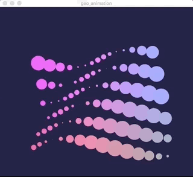

## Processing Python Mode

Example [Processing.py](https://py.processing.org/) sketch which is a Python version of this [processing sketch](https://www.openprocessing.org/sketch/405926) by [Saskia Freeke](https://www.openprocessing.org/user/48307)

## Preview

